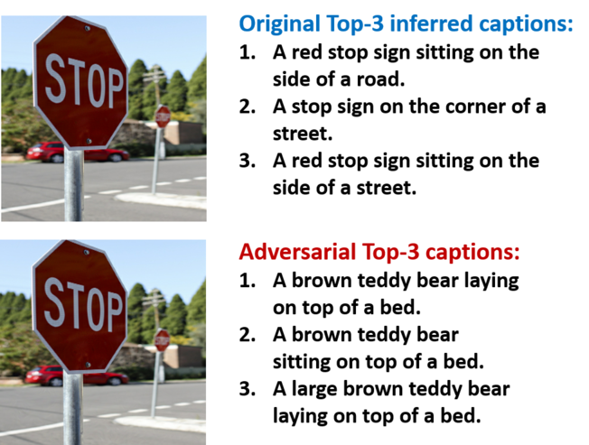

# Show and Fool: Crafting Adversarial Examples for Neural Image Captioning

A TensorFlow implementation of the adversarial examples generating models described in the paper:

"Show and Fool: Crafting Adversarial Examples for Neural Image Captioning"

Hongge Chen\*, Huan Zhang\*, Pin-Yu Chen, Jinfeng Yi and Cho-Jui Hsieh


Full text available at: (arxiv link)


## Introduction

The *Show-and-Fool* model is designed to generate adversarial examples for neural image captioning. Our model is based on  [Show and Tell](https://github.com/tensorflow/models/tree/master/research/im2txt). 

For example:




## Prerequisites 

The following python packages are required to run this code repository:

```
sudo apt-get install python3-pip
sudo pip3 install --upgrade pip
sudo pip3 install pillow scipy numpy tensorflow-gpu keras
```

## Getting Started

Clone this directory:

```
git clone https://github.com/huanzhang12/ImageCaptioningAttack.git
```

Download pretrained model for Show-and-Tell:

```
./download_model.sh
```

Pretrained model will be saved to `im2txt/pretrained`.

### Run the Demo

To quickly try our image captioning attack, a demo script is provided. By default, this script will turn the caption
of a specified image into the caption of another arbitrary target image:

```
./demo.sh <image_to_attack> <image_of_target_sentence> <result_output_directory> [additional options] ...
```

Specifically, given an image `<image_to_attack>` to attack and another
irrelevant target image `<image_of_target_sentence>` as our target, we first
infer the caption using Show-and-Tell model on the target image. This caption
is called the **target caption**. Then we try to generate an adversarial image
that looks almost identical to `<image_to_attack>` but on which the neural
image captioning system will generate *exactly* the same caption as the target
caption. Resulting adversarial image (and some relevant information) is saved
into folder `<result_output_directory>`.

We provided some example images from the COCO dataset in the `examples` folder,
so you can quickly test the targeted attack by running:

```
./demo.sh examples/image1.png examples/image2.png result_dir
```

In this demo we provide 4 attack modes: targeted caption attack, untargeted
caption attack, targeted keyword attack and untargeted keyword attack. 
We can pass additional parameters to `demo.sh` to select an attack mode. There are
two boolean parameters to control the attack mode, `use_keywords` and
`targeted`.  For example, `--use_keywords=False` and
`--targeted=True` give you targeted caption attack. If you are using
untargeted attack, `<image_of_target_sentence>` is ignored.
By default, `--targeted=True --use_keywords=False`.

An example of targeted keywords attack with keywords `dog` and `frisbee` is:

```
./demo.sh examples/image1.png examples/image2.png result_dir --use_keywords --input_feed="dog frisbee"
```

### Run Multiple Attacks on MSCOCO Dataset

To run multiple attacks on MSCOCO dataset, you need to do `./run_attack.sh. ` It is similar to `./run_show_and_fool_demo.sh`. But before you do this, please go to `run_attack.sh` and specify 2 paths:

(i) `${CAPTION_FILE}` is the path to the validation set's caption file, in JSON format (for example ../coco-caption/annotations/captions_val2014.json)

(ii) `${IMAGE_DIRECTORY}` is the directory of MSCOCO validation set (for example ../mscoco/image/val2014/)

There are 3 required parameters, `OFFSET`. `NUM_ATTACKS` and `OUTPUT_DIR`. When we do the experiments on MSCOCO validation set, we first randomly shuffle the images. Then we pick images in this queue one by one to attack. `NUM_ATTACKS` detemines the number of experiments. One experiment means attack on one image. `OFFSET` ss the index of the first image in the queue to be attacked. `OUTPUT_DIR` is the directory in which you save the results. We also add a `/fail_log` directory in the result directory to save the log of failed attacks. 

We also have a parameter `use_logits` for you to choose between the logits loss or log-prob loss. To use logits loss, simply add `--use_logits=True` and to use log-prob loss, add `--use_logits=False`. The detailed form of our losses can be find in our paper. There are other parameters for you to tune, such as number of iterations, initial constant C, norm (l2 or l_infinity) and beam search size. You can check `run_attack_BATCH_search_C.py` for details.

 


